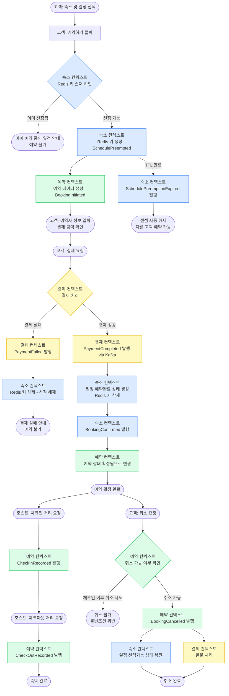
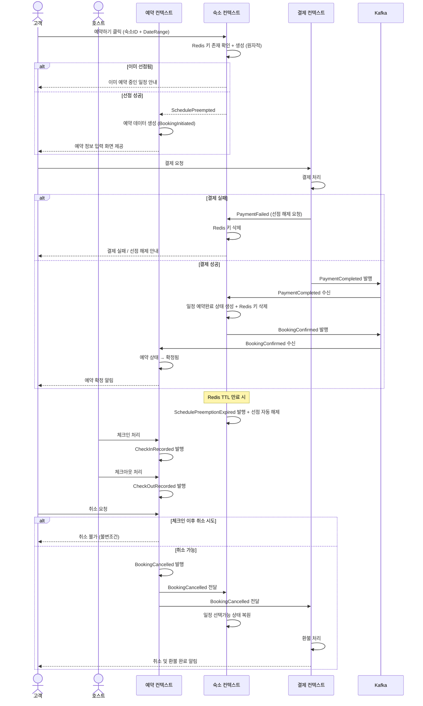
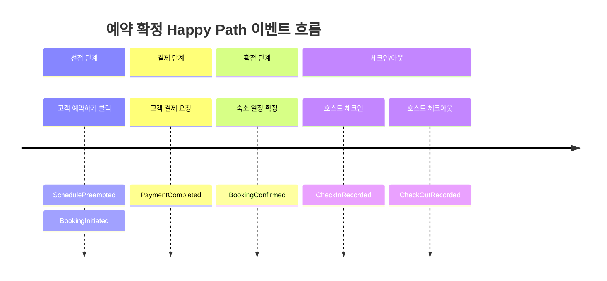

# 사용자 행동 흐름 (User Action Flow)

> 기반 설계: `step1_requirements/ddd_analysis.md`, `step1_requirements/requirement_card.md`
> 도메인: 예약 컨텍스트 / 숙소 컨텍스트 / 결제 컨텍스트

---

## 1. 전체 흐름 (Flowchart)

---

## 2. 컨텍스트 간 이벤트 흐름 (Sequence Diagram)

---

## 3. 도메인 이벤트 발생 타임라인

---

## 4. 도메인별 책임 요약

| 색상 | 컨텍스트 | 주요 책임 |
|------|---------|---------|
| 파랑 | 숙소 컨텍스트 | 선점 생성/해제, 일정 상태 관리, Redis 키 생명주기 |
| 초록 | 예약 컨텍스트 | 예약 상태 전이, 불변조건 강제, 체크인/아웃 기록 |
| 노랑 | 결제 컨텍스트 | 결제 처리, 환불, 이벤트 발행 (Kafka) |